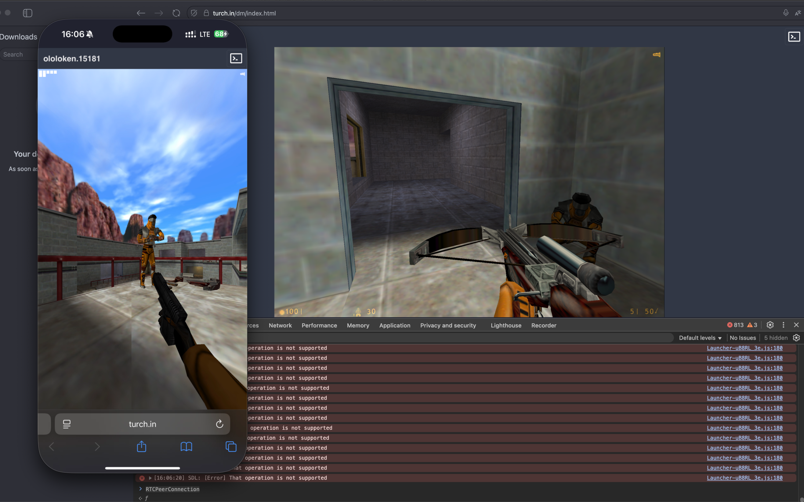

[Live demo deathmatch](https://turch.in/dm/index.html) ~80mb
=
How to play with friends
-
In the title you'll see _ololoken.NNNN_— this is your virtual lan host name.
When you create LAN server another player can connect to your game using console command `connect ololoken.NNNN`.
Just send him the link to the demo and your virtual host name.


Here you can see running game server in iphone's browser with connected desktop client. 

[Поиграть в русскую версию первой халфы](https://turch.in/zhl/index.html) ~200mb
=


In case of any issues open demos in private tab and/or using dev console purge indexeddb with name `/xash`.
Dev tools console command is `indexedDB.deleteDatabase('/xash')`.


How to build
-

> First, install and configure emsdk.

[emscripten xash3d fork](https://github.com/ololoken/xash3d-fwgs) 
```
emconfigure ./waf configure --emscripten && emmake ./waf build && emmake ./waf install --destdir ./out
```

[emscripten hlsdk-portable fork](https://github.com/ololoken/hlsdk-portable)
```
 emconfigure ./waf configure --emscripten -T release && emmake ./waf && emconfigure ./waf install --destdir out
```

copy output to `src/assets/module`

To run the game you'll need data pack:
1. cd /path/to/hl/valve
2. `zip -r -9 data.zip .`
3. copy data.zip to `src/assets/module`
4. run server `npx tsx server.ts` in the source root 
5. run `npm run dev` in the source root
6. http://localhost:8086 here will be your game
